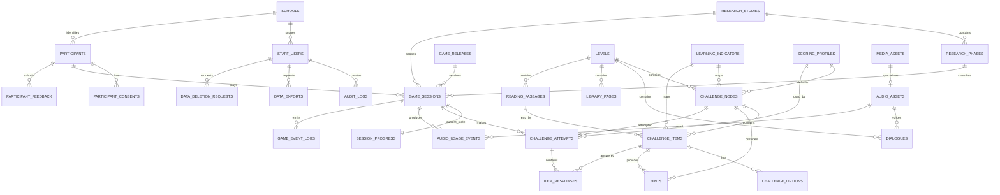

# 01_DATABASE.md — Database & Struktur Data

Proyek: **GELITA** (Game Edukasi Literasi dan Etnopedagogi Kedu)
Stack: CodeIgniter 4.7.x · PHP 8.2+ · MySQL 8.0 / MariaDB 10.6+ · InnoDB · utf8mb4

> **Revisi 2 (21 September 2026).** Perubahan terhadap versi pertama: (1) siswa **wajib registrasi dengan nama pengguna dan kata sandi kuat** sebagai bagian literasi keamanan digital — kolom akun ditambahkan ke `participants`; (2) tabel baru `reading_passages` untuk teks bacaan yang dipakai beberapa soal; (3) interaksi `boolean_*` diganti `verdict_*` yang mendukung pilihan **Benar / Salah / Pendapat**; (4) kata pengecoh rumpang pindah ke `challenge_nodes.config_json`; (5) kolom `review_status` pada `challenge_items`; (6) metadata 15 node dan isi soal diambil dari **Dokumen Bank Soal GELITA** dan dimuat lewat impor XLSX. Total tabel menjadi **29**.

---

## Tujuan

Membuat seluruh skema database GELITA production dari nol: 29 tabel domain (ditambah tabel sesi CI4 `ci_sessions`), relasi, index, migration, dan seeder. Setelah tahap ini selesai, database siap menerima data konten dan data penelitian tanpa perlu melihat sistem mana pun sebelumnya.

---

## Konteks

GELITA adalah game edukasi berbasis penelitian untuk siswa SD/SMP. Pemain berperan sebagai **Jaka**, anak pembawa lentera, dibimbing **Mbah Kedu**, menjelajahi tiga wilayah eks-Karesidenan Kedu untuk mengumpulkan "Serpihan Cahaya".

Struktur permainan:

```
3 Level (wilayah)  ×  5 Challenge Node per level  =  15 node
1 Challenge Node   →  1..n Challenge Item (unit atomic yang dinilai)
```

Urutan level production (**wajib**, tidak boleh diubah):

| Sequence | Code | Nama | Difficulty | Fokus belajar |
|---:|---|---|---|---|
| 1 | `temanggung` | Temanggung | mudah | Menemukan informasi tersurat |
| 2 | `magelang` | Magelang | sedang | Menghubungkan & membandingkan informasi |
| 3 | `wonosobo` | Wonosobo | sulit | Menilai informasi & mengambil keputusan |

Lima engine type baseline: `puzzle`, `rumpang`, `boleh`, `pilihan`, `cari`.

Aplikasi ini sekaligus instrumen penelitian, jadi database menyimpan empat kelompok data:

1. **Research & participant** — studi, fase (umum/pretest/posttest), demographic, consent.
2. **Content** — level, node, item, option, hint, media, audio, dialog, pustaka.
3. **Gameplay** — session, progress, attempt, response, audio usage, raw event.
4. **Governance** — audit log, export, deletion request.

---

## Keputusan yang Sudah Diambil (jangan ditanyakan ulang)

Dokumen sumber sebelumnya mengandung beberapa konflik. Berikut keputusan final untuk proyek baru:

| # | Konflik | Keputusan |
|---|---|---|
| D1 | Urutan wilayah (ada versi Magelang dulu) | **Temanggung → Magelang → Wonosobo**, disimpan di `levels.sequence` |
| D2 | Jumlah serpihan (ada angka 12 dan 15) | **15**, dihitung dari `COUNT(challenge_nodes aktif)`, bukan konstanta |
| D3 | Konsep "babak"/`jumlah` per pos | **Dihapus.** Satu node = satu attempt. Banyaknya soal diatur `items_per_round` di `challenge_nodes.config_json` |
| D4 | Bank soal vs soal yang tampil | Node menyimpan **bank item**; server memilih subset saat attempt dibuat dan menuliskannya sebagai baris `item_responses` berstatus `pending` |
| D5 | Formula skor lama (`benarAwal*10 + bonus`) | **Diganti** formula v2 tersimpan di `scoring_profiles` (kode `GELITA_V2`) |
| D6 | Akun pemain berkata sandi | **Siswa wajib registrasi** dengan `username` + kata sandi kuat (minimal 8 karakter, huruf besar, huruf kecil, angka, simbol). Ini materi literasi keamanan digital, bukan sekadar mekanisme login. `participant_code` tetap ada sebagai kode pseudonim penelitian; `session_code` hanya pengenal internal sesi, bukan token login |
| D7 | Tabel sprite sheet/animation | **Tidak dibuat.** Animasi karakter memakai CSS + frame di `media_assets`, dikonfigurasi di file PHP config |
| D8 | Pustaka Kedu tidak ada di rancangan tabel | **Ditambahkan** tabel `library_pages` |
| D9 | Kritik & saran (Balai Refleksi) tidak ada di rancangan tabel | **Ditambahkan** tabel `participant_feedback` |
| D10 | Analitik kunjungan sebagai tabel terpisah | **Digabung** ke `game_sessions` (device/os/browser) + `game_event_logs` |
| D11 | Scope guru | `staff_users.school_id` nullable. `admin` = semua data, `guru` = hanya peserta pada sekolah yang sama |
| D12 | Boleh ada >1 sesi pada fase yang sama | **Boleh.** Analitik memakai sesi `completed` terakhir per (participant, study, phase) sebagai default |
| D13 | Unlock level | **Sequential** secara default; `research_studies.unlock_mode` = `sequential` \| `free`. Nilai `free` (bukan `open`) dipakai agar tidak tertukar dengan status wilayah/node `open` di layar peta |
| D14 | Retention period | Default **1825 hari (5 tahun)** di `research_studies.retention_days`, dapat diubah admin |
| D15 | `district` = kabupaten saja atau termasuk kota | **Kabupaten dan kota**, satu kolom `district_*` |
| D16 | Master wilayah Indonesia sebagai tabel DB | **Tidak.** Dipakai file statis `public/assets/data/wilayah-id.json`; yang disimpan di DB hanya kode + snapshot nama |
| D17 | Jawaban alasan (reasoning) Wonosobo | Kolom `item_responses.reason_text`; **tidak di-auto-score**, ditandai untuk review manual |
| D18 | Soal fakta vs pendapat (CP Magelang) tidak muat di model benar/salah | Interaksi `verdict_card` / `verdict_reason` dengan `answer_key_json.verdict` = `benar` \| `salah` \| `pendapat`. Pilihan yang tampil diatur `config_json.verdict_options` per node |
| D19 | Satu teks bacaan dipakai beberapa soal (mis. Teks A dipakai node 3 dan 5 Temanggung) | Tabel `reading_passages` per level; item merujuk lewat `passage_id` |
| D20 | Pengecoh rumpang disimpan sebagai opsi palsu pada item pertama | Pindah ke `challenge_nodes.config_json.distractors` |
| D21 | Sebagian fakta konten masih bertanda [PERLU VERIFIKASI] | Kolom `challenge_items.review_status` (`draft` \| `needs_verification` \| `verified`) + `review_note`. Item `needs_verification` tetap boleh aktif tetapi dilaporkan `gelita:content:verify` |
| D22 | Cara memasukkan 119 butir soal | Workbook XLSX bank soal (templat di 07) diimpor lewat panel admin atau `php spark gelita:bank:import` dalam satu transaction |
| D23 | Metrik literasi keamanan digital saat registrasi | Disimpan sebagai angka di `participants` (`pw_first_submit_criteria`, `pw_weak_submit_count`). Kata sandi dan petunjuknya **tidak pernah** dicatat dalam bentuk apa pun |

---

## Yang Harus Dibuat

1. Database `gelita` (utf8mb4_unicode_ci, InnoDB).
2. 29 migration pembuat tabel + migration pendukung (`002900` FK level, `003000` `ci_sessions`) + migration koreksi (`003100`–`003300`) — total 34 berkas.
3. 9 seeder data, dijalankan berurutan oleh `DatabaseSeeder` (kelas dasar bersama: `GelitaSeeder`).
4. File referensi statis `public/assets/data/wilayah-id.json` (tidak masuk DB).

---

## Konvensi Umum

* Semua PK: `id BIGINT UNSIGNED AUTO_INCREMENT PRIMARY KEY`.
* Timestamp: `DATETIME(6)` (presisi mikrodetik diperlukan untuk urutan event penelitian).
* `created_at` default `CURRENT_TIMESTAMP(6)`, `updated_at` default `CURRENT_TIMESTAMP(6) ON UPDATE CURRENT_TIMESTAMP(6)`.
* Soft delete hanya pada tabel yang butuh jejak penghapusan: `participants`, `game_event_logs`.
* Kolom teks dwibahasa memakai pasangan `*_id` (Indonesia) dan `*_en` (English). Bila `*_en` kosong, aplikasi menampilkan `*_id`.
* Engine: InnoDB. Charset: `utf8mb4`, collation `utf8mb4_unicode_ci`.
* FK `ON DELETE RESTRICT` untuk konten, `ON DELETE CASCADE` untuk data turunan gameplay, `ON DELETE SET NULL` untuk referensi opsional.

---

## Database Architecture



---

## Table Specification

### 1. `staff_users`

Akun guru/admin. Akun siswa disimpan terpisah di `participants` (bagian 5) — dua jenis akun ini tidak pernah digabung.

| Kolom | Tipe | Null | Default | Keterangan |
|---|---|---|---|---|
| id | BIGINT UNSIGNED | NO | AUTO | PK |
| username | VARCHAR(100) | NO | — | UNIQUE |
| email | VARCHAR(190) | YES | NULL | UNIQUE |
| password_hash | VARCHAR(255) | NO | — | `password_hash()` PASSWORD_DEFAULT |
| role | VARCHAR(20) | NO | `guru` | `admin` \| `guru`; INDEX |
| display_name | VARCHAR(150) | NO | — | |
| school_id | BIGINT UNSIGNED | YES | NULL | FK `schools.id` ON DELETE SET NULL; NULL = semua sekolah |
| is_active | TINYINT(1) | NO | 1 | INDEX |
| failed_login_count | SMALLINT UNSIGNED | NO | 0 | untuk throttling |
| locked_until | DATETIME(6) | YES | NULL | |
| last_login_at | DATETIME(6) | YES | NULL | |
| created_at | DATETIME(6) | NO | CURRENT | |
| updated_at | DATETIME(6) | NO | CURRENT | |

### 2. `research_studies`

| Kolom | Tipe | Null | Default | Keterangan |
|---|---|---|---|---|
| id | BIGINT UNSIGNED | NO | AUTO | PK |
| code | VARCHAR(50) | NO | — | UNIQUE |
| name | VARCHAR(200) | NO | — | |
| description | TEXT | YES | NULL | |
| year_label | VARCHAR(20) | YES | NULL | INDEX, mis. `2026/2027` |
| status | VARCHAR(20) | NO | `draft` | `draft` \| `active` \| `closed`; INDEX |
| retention_days | INT UNSIGNED | NO | 1825 | D14 |
| default_locale | VARCHAR(5) | NO | `id` | `id` \| `en` |
| unlock_mode | VARCHAR(20) | NO | `sequential` | `sequential` \| `free` (D13) |
| item_selection_mode | VARCHAR(20) | NO | `fixed` | `fixed` (seeded per participant) \| `random` |
| require_consent | TINYINT(1) | NO | 1 | |
| active_phase_code | VARCHAR(20) | NO | `umum` | fase yang sedang berjalan: `umum` \| `pretest` \| `posttest`; dipakai saat siswa registrasi/login |
| allow_phase_choice | TINYINT(1) | NO | 0 | 1 = siswa memilih fase sendiri di form registrasi/login; 0 = selalu `active_phase_code` |
| created_at | DATETIME(6) | NO | CURRENT | |
| updated_at | DATETIME(6) | NO | CURRENT | |

> `item_selection_mode = fixed` memakai benih `participant_code + '|' + node_id`, sehingga peserta yang sama mengerjakan butir identik pada pretest dan posttest. Ini syarat mutlak desain pretest–posttest.

### 3. `research_phases`

Tepat 3 baris per study.

| Kolom | Tipe | Null | Default | Keterangan |
|---|---|---|---|---|
| id | BIGINT UNSIGNED | NO | AUTO | PK |
| study_id | BIGINT UNSIGNED | NO | — | FK `research_studies.id` CASCADE; INDEX |
| code | VARCHAR(20) | NO | — | `umum` \| `pretest` \| `posttest` |
| sequence | TINYINT UNSIGNED | NO | 1 | |
| label_id | VARCHAR(150) | NO | — | |
| label_en | VARCHAR(150) | NO | — | |
| is_active | TINYINT(1) | NO | 1 | |

UNIQUE: `(study_id, code)`.

### 4. `schools`

| Kolom | Tipe | Null | Default | Keterangan |
|---|---|---|---|---|
| id | BIGINT UNSIGNED | NO | AUTO | PK |
| code | VARCHAR(80) | YES | NULL | UNIQUE (NPSN bila ada) |
| name | VARCHAR(200) | NO | — | INDEX |
| country_code | VARCHAR(5) | YES | `ID` | INDEX |
| province_code | VARCHAR(10) | YES | NULL | INDEX |
| district_code | VARCHAR(10) | YES | NULL | INDEX |
| is_active | TINYINT(1) | NO | 1 | |
| created_at | DATETIME(6) | NO | CURRENT | |
| updated_at | DATETIME(6) | NO | CURRENT | |

### 5. `participants`

| Kolom | Tipe | Null | Default | Keterangan |
|---|---|---|---|---|
| id | BIGINT UNSIGNED | NO | AUTO | PK |
| participant_code | VARCHAR(40) | NO | — | UNIQUE, format `GLT-000001`; kode pseudonim penelitian |
| username | VARCHAR(30) | NO | — | UNIQUE; huruf kecil, angka, titik, garis bawah; 3–30 karakter |
| password_hash | VARCHAR(255) | NO | — | `password_hash()` PASSWORD_DEFAULT |
| must_change_password | TINYINT(1) | NO | 0 | 1 setelah guru mereset sandi |
| display_name | VARCHAR(150) | YES | NULL | nama asli; dapat disembunyikan saat export |
| age | TINYINT UNSIGNED | YES | NULL | INDEX; 5–80 |
| gender | VARCHAR(20) | YES | NULL | `laki-laki` \| `perempuan` \| `lainnya`; INDEX |
| class_level | VARCHAR(20) | YES | NULL | `1`..`9` \| `lain`; INDEX |
| school_id | BIGINT UNSIGNED | YES | NULL | FK `schools.id` SET NULL; INDEX |
| school_name_snapshot | VARCHAR(200) | YES | NULL | INDEX |
| country_code | VARCHAR(5) | YES | `ID` | INDEX |
| country_name_snapshot | VARCHAR(100) | YES | NULL | |
| province_code | VARCHAR(10) | YES | NULL | INDEX |
| province_name_snapshot | VARCHAR(120) | YES | NULL | |
| district_code | VARCHAR(10) | YES | NULL | INDEX |
| district_name_snapshot | VARCHAR(120) | YES | NULL | |
| pw_first_submit_criteria | TINYINT UNSIGNED | YES | NULL | 0–5: jumlah syarat sandi yang terpenuhi pada **percobaan kirim pertama** formulir registrasi |
| pw_weak_submit_count | SMALLINT UNSIGNED | NO | 0 | berapa kali formulir ditolak karena sandi belum kuat |
| failed_login_count | SMALLINT UNSIGNED | NO | 0 | |
| locked_until | DATETIME(6) | YES | NULL | |
| last_login_at | DATETIME(6) | YES | NULL | |
| password_changed_at | DATETIME(6) | YES | NULL | |
| created_at | DATETIME(6) | NO | CURRENT | |
| updated_at | DATETIME(6) | NO | CURRENT | |
| deleted_at | DATETIME(6) | YES | NULL | INDEX (soft delete) |

> Snapshot nama disimpan agar catatan penelitian lama tetap terbaca meski master sekolah/wilayah berubah.

**Kebijakan kata sandi siswa** (sama persis di server dan di JavaScript; sumbernya satu, yaitu `Config\Gelita::$passwordPolicy`):

| # | Syarat | Aturan |
|---:|---|---|
| 1 | Panjang | minimal 8 karakter, maksimal 64 karakter (dan ≤ 72 byte, batas bcrypt) |
| 2 | Huruf besar | minimal satu `A–Z` |
| 3 | Huruf kecil | minimal satu `a–z` |
| 4 | Angka | minimal satu `0–9` |
| 5 | Simbol | minimal satu karakter bukan huruf/angka, mis. `! @ # $ % ^ & * ? _ -` |
| — | Tambahan server | tidak boleh memuat `username`; ulangan sandi harus sama persis |

Tingkat kekuatan untuk tampilan: **lemah** = 0–2 syarat, **sedang** = 3–4 syarat, **kuat** = 5 syarat. Registrasi hanya diterima bila **kuat**.

`pw_first_submit_criteria` dan `pw_weak_submit_count` adalah data proses literasi keamanan digital: keduanya dihitung server dari percobaan kirim formulir, disimpan saat akun berhasil dibuat, dan tidak memuat informasi apa pun tentang isi kata sandi.

### 6. `participant_consents`

| Kolom | Tipe | Null | Default | Keterangan |
|---|---|---|---|---|
| id | BIGINT UNSIGNED | NO | AUTO | PK |
| participant_id | BIGINT UNSIGNED | NO | — | FK CASCADE; INDEX |
| study_id | BIGINT UNSIGNED | YES | NULL | FK SET NULL |
| consent_version | VARCHAR(50) | NO | — | INDEX |
| participant_consented | TINYINT(1) | NO | 0 | |
| parent_guardian_consented | TINYINT(1) | NO | 0 | |
| guardian_name | VARCHAR(150) | YES | NULL | |
| consent_text_snapshot | TEXT | NO | — | teks persetujuan saat itu |
| consented_at | DATETIME(6) | YES | NULL | |
| withdrawn_at | DATETIME(6) | YES | NULL | |
| metadata_json | JSON | YES | NULL | |
| created_at | DATETIME(6) | NO | CURRENT | |

### 7. `game_releases`

| Kolom | Tipe | Null | Default | Keterangan |
|---|---|---|---|---|
| id | BIGINT UNSIGNED | NO | AUTO | PK |
| release_code | VARCHAR(80) | NO | — | UNIQUE |
| app_version | VARCHAR(30) | NO | — | |
| content_version | VARCHAR(30) | NO | — | |
| asset_version | VARCHAR(30) | NO | — | |
| scoring_version | VARCHAR(30) | NO | — | |
| published_at | DATETIME(6) | YES | NULL | INDEX |
| notes | TEXT | YES | NULL | |
| is_active | TINYINT(1) | NO | 0 | hanya satu boleh aktif |

### 8. `levels`

Tepat 3 baris.

| Kolom | Tipe | Null | Default | Keterangan |
|---|---|---|---|---|
| id | BIGINT UNSIGNED | NO | AUTO | PK |
| sequence | TINYINT UNSIGNED | NO | — | UNIQUE; 1..3 |
| code | VARCHAR(40) | NO | — | UNIQUE; `temanggung`/`magelang`/`wonosobo` |
| name_id | VARCHAR(100) | NO | — | |
| name_en | VARCHAR(100) | NO | — | |
| difficulty | VARCHAR(20) | NO | — | `mudah`/`sedang`/`sulit`; INDEX |
| focus_id | TEXT | NO | — | |
| focus_en | TEXT | NO | — | |
| cp_id | TEXT | YES | NULL | capaian pembelajaran |
| cp_en | TEXT | YES | NULL | |
| tp_id | TEXT | YES | NULL | tujuan pembelajaran |
| tp_en | TEXT | YES | NULL | |
| intro_id | TEXT | YES | NULL | keterangan wilayah (popup info) |
| intro_en | TEXT | YES | NULL | |
| map_media_id | BIGINT UNSIGNED | YES | NULL | FK `media_assets.id` SET NULL — peta pos |
| background_media_id | BIGINT UNSIGNED | YES | NULL | FK SET NULL — latar wilayah |
| badge_media_id | BIGINT UNSIGNED | YES | NULL | FK SET NULL — lencana |
| map_x | DECIMAL(5,2) | NO | 50.00 | posisi titik di peta Kedu, % lebar |
| map_y | DECIMAL(5,2) | NO | 50.00 | % tinggi |
| is_active | TINYINT(1) | NO | 1 | INDEX |
| created_at | DATETIME(6) | NO | CURRENT | |
| updated_at | DATETIME(6) | NO | CURRENT | |

### 9. `learning_indicators`

| Kolom | Tipe | Null | Default | Keterangan |
|---|---|---|---|---|
| id | BIGINT UNSIGNED | NO | AUTO | PK |
| code | VARCHAR(50) | NO | — | UNIQUE; `literasi`/`budaya`/`sikap` |
| name_id | VARCHAR(200) | NO | — | |
| name_en | VARCHAR(200) | NO | — | |
| description_id | TEXT | YES | NULL | |
| description_en | TEXT | YES | NULL | |
| domain | VARCHAR(50) | YES | NULL | INDEX |
| is_active | TINYINT(1) | NO | 1 | |

### 10. `scoring_profiles`

| Kolom | Tipe | Null | Default |
|---|---|---|---|
| id | BIGINT UNSIGNED | NO | AUTO |
| code | VARCHAR(50) | NO | — |
| version | VARCHAR(20) | NO | — |
| first_pass_weight | DECIMAL(6,4) | NO | 0.7000 |
| final_weight | DECIMAL(6,4) | NO | 0.2000 |
| independence_weight | DECIMAL(6,4) | NO | 0.1000 |
| hint_penalty_per_use | DECIMAL(8,4) | NO | 10.0000 |
| retry_penalty_per_extra_attempt | DECIMAL(8,4) | NO | 5.0000 |
| three_star_min_score | DECIMAL(5,2) | NO | 85.00 |
| three_star_min_first_pass | DECIMAL(5,2) | NO | 80.00 |
| two_star_min_score | DECIMAL(5,2) | NO | 65.00 |
| is_active | TINYINT(1) | NO | 1 |
| created_at | DATETIME(6) | NO | CURRENT |

UNIQUE: `(code, version)`.

### 11. `media_assets`

| Kolom | Tipe | Null | Default | Keterangan |
|---|---|---|---|---|
| id | BIGINT UNSIGNED | NO | AUTO | PK |
| asset_key | VARCHAR(160) | NO | — | UNIQUE; mis. `bg.temanggung.region` |
| asset_type | VARCHAR(20) | NO | — | `image`\|`audio`\|`video`\|`sprite_frame`; INDEX |
| storage_path | VARCHAR(500) | NO | — | relatif terhadap `public/`, mis. `assets/bg/bg-temanggung.jpg` |
| mime_type | VARCHAR(100) | NO | — | |
| file_size | BIGINT UNSIGNED | YES | NULL | |
| sha256 | CHAR(64) | YES | NULL | INDEX |
| width_px | INT UNSIGNED | YES | NULL | |
| height_px | INT UNSIGNED | YES | NULL | |
| locale | VARCHAR(5) | YES | NULL | diisi bila gambar memuat tulisan (`id`/`en`) |
| credit | VARCHAR(500) | YES | NULL | |
| version | VARCHAR(20) | NO | `1` | |
| is_active | TINYINT(1) | NO | 1 | |
| created_at | DATETIME(6) | NO | CURRENT | |
| updated_at | DATETIME(6) | NO | CURRENT | |

### 12. `audio_assets`

| Kolom | Tipe | Null | Default | Keterangan |
|---|---|---|---|---|
| id | BIGINT UNSIGNED | NO | AUTO | PK |
| media_asset_id | BIGINT UNSIGNED | NO | — | UNIQUE, FK CASCADE |
| locale | VARCHAR(5) | NO | — | `id`\|`en`; INDEX |
| character_code | VARCHAR(30) | YES | NULL | `jaka`\|`mbah_kedu`; INDEX |
| context_code | VARCHAR(80) | NO | — | mis. `dialogue.temanggung.1`, `sfx.correct`; INDEX |
| transcript | LONGTEXT | NO | — | wajib, dipakai tombol transcript |
| production_method | VARCHAR(20) | NO | `own_recording` | `own_recording`\|`ai_generated` |
| voice_profile | VARCHAR(200) | YES | NULL | |
| duration_ms | INT UNSIGNED | YES | NULL | diukur server-side saat upload |
| approval_status | VARCHAR(20) | NO | `draft` | `draft`\|`review`\|`approved`\|`rejected`; INDEX |
| approved_by | BIGINT UNSIGNED | YES | NULL | FK `staff_users.id` SET NULL |
| approved_at | DATETIME(6) | YES | NULL | |
| version | VARCHAR(20) | NO | `1` | |

> Hanya audio berstatus `approved` yang dikirim ke pemain.

### 13. `challenge_nodes`

5 baris per level, total 15.

| Kolom | Tipe | Null | Default | Keterangan |
|---|---|---|---|---|
| id | BIGINT UNSIGNED | NO | AUTO | PK |
| level_id | BIGINT UNSIGNED | NO | — | FK `levels.id` RESTRICT; INDEX |
| sequence | TINYINT UNSIGNED | NO | — | 1..5 |
| engine_type | VARCHAR(20) | NO | — | `puzzle`\|`rumpang`\|`boleh`\|`pilihan`\|`cari`; INDEX |
| variant_code | VARCHAR(60) | YES | NULL | mis. `rumpang_tanpa_bank`; INDEX |
| title_id | VARCHAR(250) | NO | — | |
| title_en | VARCHAR(250) | NO | — | |
| instruction_id | TEXT | YES | NULL | |
| instruction_en | TEXT | YES | NULL | |
| description_id | TEXT | YES | NULL | teks kartu misi |
| description_en | TEXT | YES | NULL | |
| indicator_id | BIGINT UNSIGNED | YES | NULL | FK `learning_indicators.id` SET NULL |
| scoring_profile_id | BIGINT UNSIGNED | YES | NULL | FK SET NULL; NULL = profil aktif default |
| background_media_id | BIGINT UNSIGNED | YES | NULL | FK SET NULL |
| scene_media_id | BIGINT UNSIGNED | YES | NULL | FK SET NULL — adegan `cari`, gambar `puzzle` |
| audio_intro_id | BIGINT UNSIGNED | YES | NULL | FK `audio_assets.id` SET NULL (locale id) |
| audio_intro_en_id | BIGINT UNSIGNED | YES | NULL | FK `audio_assets.id` SET NULL |
| config_json | JSON | YES | NULL | lihat skema di bawah |
| map_x | DECIMAL(5,2) | NO | 50.00 | posisi pos di peta level |
| map_y | DECIMAL(5,2) | NO | 50.00 | |
| content_version | VARCHAR(20) | NO | `1` | INDEX |
| is_active | TINYINT(1) | NO | 1 | INDEX |
| created_at | DATETIME(6) | NO | CURRENT | |
| updated_at | DATETIME(6) | NO | CURRENT | |

UNIQUE: `(level_id, sequence)`.

**Skema `config_json` per engine_type** (semua kunci opsional, pakai default bila tidak ada):

```jsonc
// puzzle
{ "items_per_round": 1, "grid": 3, "allow_retry": true }

// rumpang
{ "items_per_round": 4, "use_word_bank": true, "distractor_count": 2, "allow_retry": true,
  "distractors": [ {"id":"salju","en":"snow"}, {"id":"laut","en":"sea"} ] }

// boleh  (engine penilaian pernyataan)
{ "items_per_round": 8, "allow_retry": true,
  "verdict_options": ["benar","salah"],        // Magelang node 3: ["benar","salah","pendapat"]
  "require_reason": false }

// pilihan
{ "items_per_round": 3, "allow_retry": false, "shuffle_options": true }

// cari
{ "items_per_round": 4, "allow_retry": true, "show_decoys": true }
```

* `items_per_round` — banyaknya item yang dipilih dari bank untuk satu attempt.
* `allow_retry` — `false` berarti jawaban pertama = jawaban final (dipakai `pilihan`).
* `distractors` — kata pengecoh bank kata rumpang. Server mengambil `distractor_count` pengecoh secara acak per attempt, lalu mencampurnya dengan jawaban item yang terpilih.
* `verdict_options` — tombol yang tampil pada kartu engine `boleh`. Label diambil dari file bahasa: Benar/True, Salah/False, Pendapat/Opinion.

### 14. `challenge_items`

Unit atomic yang dinilai. Ini adalah **bank soal**, bukan jawaban peserta.

| Kolom | Tipe | Null | Default | Keterangan |
|---|---|---|---|---|
| id | BIGINT UNSIGNED | NO | AUTO | PK |
| challenge_node_id | BIGINT UNSIGNED | NO | — | FK CASCADE; INDEX |
| item_key | VARCHAR(100) | NO | — | mis. `tmg-2-01` |
| sequence | SMALLINT UNSIGNED | NO | 1 | INDEX |
| interaction_type | VARCHAR(40) | NO | — | lihat daftar di bawah; INDEX |
| prompt_id | TEXT | YES | NULL | kalimat rumpang / pertanyaan / petunjuk / teks kartu |
| prompt_en | TEXT | YES | NULL | |
| source_text_id | LONGTEXT | YES | NULL | teks sumber khusus item ini |
| source_text_en | LONGTEXT | YES | NULL | |
| passage_id | BIGINT UNSIGNED | YES | NULL | FK `reading_passages.id` SET NULL — teks bacaan bersama |
| answer_key_json | JSON | YES | NULL | bentuk berbeda per interaction_type |
| media_asset_id | BIGINT UNSIGNED | YES | NULL | FK SET NULL — gambar puzzle/kartu/objek |
| indicator_id | BIGINT UNSIGNED | YES | NULL | FK SET NULL — indikator per butir |
| config_json | JSON | YES | NULL | koordinat objek `cari`, flag decoy, dll |
| reference_source | VARCHAR(500) | YES | NULL | sumber rujukan konten (lembaga/judul + URL) |
| review_status | VARCHAR(30) | NO | `draft` | `draft` \| `needs_verification` \| `verified`; INDEX |
| review_note | TEXT | YES | NULL | catatan verifikasi fakta |
| scorable | TINYINT(1) | NO | 1 | 0 = tidak ikut dihitung |
| is_active | TINYINT(1) | NO | 1 | INDEX |
| created_at | DATETIME(6) | NO | CURRENT | |
| updated_at | DATETIME(6) | NO | CURRENT | |

UNIQUE: `(challenge_node_id, item_key)`.

**Nilai `interaction_type` yang didukung:**

| interaction_type | Dipakai engine | Bentuk `answer_key_json` |
|---|---|---|
| `puzzle_arrange` | puzzle | `{"order":[0,1,2,3,4,5,6,7,8]}` |
| `fill_blank_bank` | rumpang | `{"text_id":"Magelang","text_en":"Magelang"}` |
| `fill_blank_free` | rumpang | `{"accept_id":["stupa"],"accept_en":["stupa"],"case_sensitive":false}` |
| `verdict_card` | boleh | `{"verdict":"benar"}` — nilai `benar` \| `salah` \| `pendapat` |
| `verdict_reason` | boleh | `{"verdict":"pendapat","sample_reason_id":"…","sample_reason_en":"…"}` — contoh alasan untuk rubrik guru |
| `single_choice` | pilihan | `{"option_key":"tmg1a"}` |
| `ordering` | puzzle (L3) | `{"order":["a","c","b","d"]}` |
| `find_object` | cari | `{"target":true}` (objek jebakan: `{"target":false}`) |
| `source_trust` | pilihan (L3) | `{"option_key":"wnb-4-01-a"}` |

Konvensi kunci: `item_key` = `{tmg|mgl|wnb}-{node}-{nomor 2 digit}`, mis. `mgl-4-03`. `option_key` = `item_key` + `-a`..`-d`, mis. `mgl-4-03-b`.

**`config_json` item per interaction_type** (kunci opsional kecuali ditandai wajib):

```jsonc
// find_object
{ "x": 18, "y": 62, "w": 13, "decoy": false,
  "wrong_feedback_id": "Angklung berasal dari Jawa Barat, bukan Temanggung.",
  "wrong_feedback_en": "Angklung is from West Java, not Temanggung." }

// ordering  (pieces wajib; key acak huruf, urutan benar ada di answer_key_json.order)
{ "pieces": [ {"key":"a","text_id":"Rebus mie…","text_en":"Boil the noodles…"}, … ] }

// verdict_card / verdict_reason  (Wonosobo node 3: dua sumber)
{ "sources": [
    {"label_id":"Sumber A","label_en":"Source A","kind":"official","text_id":"…","text_en":"…"},
    {"label_id":"Sumber B","label_en":"Source B","kind":"anonymous","text_id":"…","text_en":"…"} ] }

// single_choice (Wonosobo node 5) — label analisis literasi digital
{ "digital_pillar": "digital_skills" }   // digital_skills | digital_ethics | digital_safety | digital_culture

// puzzle_arrange — prompt_id/en dipakai sebagai deskripsi yang tampil setelah gambar utuh
{ "grid": 3 }
```

> `decoy: true` = objek jebakan dari daerah lain. Objek jebakan wajib `scorable: 0` dan tidak pernah menjadi target, tidak punya petunjuk, dan tidak pernah menahan attempt tetap terbuka. Klik pada objek yang salah (jebakan atau target lain) dicatat sebagai `wrong_target_clicked` dan `wrong_click_count`; bila itu klik pertama untuk petunjuk yang sedang dicari, first-pass petunjuk itu tertutup sebagai salah, lalu klik benar sesudahnya dihitung sebagai perubahan jawaban. Penjelasan (`wrong_feedback_*`) dikirim sesudah klik.

### 15. `challenge_options`

| Kolom | Tipe | Null | Default | Keterangan |
|---|---|---|---|---|
| id | BIGINT UNSIGNED | NO | AUTO | PK |
| challenge_item_id | BIGINT UNSIGNED | NO | — | FK CASCADE; INDEX |
| option_key | VARCHAR(60) | NO | — | |
| label_id | TEXT | NO | — | |
| label_en | TEXT | NO | — | |
| media_asset_id | BIGINT UNSIGNED | YES | NULL | FK SET NULL — gambar opsi |
| is_correct | TINYINT(1) | NO | 0 | |
| feedback_id | TEXT | YES | NULL | penjelasan saat opsi dipilih |
| feedback_en | TEXT | YES | NULL | |
| display_order | SMALLINT UNSIGNED | NO | 1 | INDEX |

UNIQUE: `(challenge_item_id, option_key)`.

> `challenge_options` hanya dipakai `single_choice` dan `source_trust`. Pengecoh rumpang **tidak** disimpan di sini, melainkan di `challenge_nodes.config_json.distractors`.

### 16. `hints`

| Kolom | Tipe | Null | Default | Keterangan |
|---|---|---|---|---|
| id | BIGINT UNSIGNED | NO | AUTO | PK |
| challenge_node_id | BIGINT UNSIGNED | YES | NULL | FK CASCADE |
| challenge_item_id | BIGINT UNSIGNED | YES | NULL | FK CASCADE |
| sequence | SMALLINT UNSIGNED | NO | 1 | |
| text_id | TEXT | NO | — | |
| text_en | TEXT | NO | — | |
| is_active | TINYINT(1) | NO | 1 | INDEX |

Aturan: minimal salah satu dari `challenge_node_id` / `challenge_item_id` harus terisi. Divalidasi di Model (MySQL CHECK tidak dipakai agar kompatibel MariaDB lama).

### 17. `dialogues`

Dialog Jaka & Mbah Kedu, termasuk cerita pembuka.

| Kolom | Tipe | Null | Default | Keterangan |
|---|---|---|---|---|
| id | BIGINT UNSIGNED | NO | AUTO | PK |
| level_id | BIGINT UNSIGNED | YES | NULL | FK CASCADE; NULL = cerita pembuka global |
| context_code | VARCHAR(50) | NO | `level_open` | `intro`\|`level_open`\|`level_done`\|`ending`; INDEX |
| sequence | INT UNSIGNED | NO | 1 | INDEX |
| character_code | VARCHAR(30) | NO | — | `jaka`\|`mbah_kedu`\|`narator` |
| title_id | VARCHAR(200) | YES | NULL | dipakai slide intro |
| title_en | VARCHAR(200) | YES | NULL | |
| text_id | LONGTEXT | NO | — | |
| text_en | LONGTEXT | NO | — | |
| audio_id_asset_id | BIGINT UNSIGNED | YES | NULL | FK `audio_assets.id` SET NULL |
| audio_en_asset_id | BIGINT UNSIGNED | YES | NULL | FK `audio_assets.id` SET NULL |
| background_media_id | BIGINT UNSIGNED | YES | NULL | FK SET NULL |
| is_active | TINYINT(1) | NO | 1 | |

UNIQUE: `(level_id, context_code, sequence)` — gunakan `level_id = 0` sentinel tidak diperlukan karena MySQL mengizinkan NULL berulang pada UNIQUE; tambahkan index biasa saja bila level_id NULL banyak.

### 18. `library_pages` (Pustaka Kedu)

Bacaan mendalam per wilayah. Tidak memengaruhi skor.

| Kolom | Tipe | Null | Default | Keterangan |
|---|---|---|---|---|
| id | BIGINT UNSIGNED | NO | AUTO | PK |
| level_id | BIGINT UNSIGNED | NO | — | FK CASCADE; INDEX |
| sequence | SMALLINT UNSIGNED | NO | 1 | halaman 1..n |
| title_id | VARCHAR(250) | NO | — | |
| title_en | VARCHAR(250) | NO | — | |
| body_id | LONGTEXT | NO | — | |
| body_en | LONGTEXT | NO | — | |
| image_a_media_id | BIGINT UNSIGNED | YES | NULL | FK SET NULL |
| image_b_media_id | BIGINT UNSIGNED | YES | NULL | FK SET NULL |
| video_media_id | BIGINT UNSIGNED | YES | NULL | FK SET NULL |
| poster_media_id | BIGINT UNSIGNED | YES | NULL | FK SET NULL |
| is_active | TINYINT(1) | NO | 1 | INDEX |
| created_at | DATETIME(6) | NO | CURRENT | |
| updated_at | DATETIME(6) | NO | CURRENT | |

UNIQUE: `(level_id, sequence)`.

### 18a. `reading_passages` (Teks Bacaan Bersama)

Teks bacaan yang dirujuk beberapa item, bahkan lintas node dalam satu level (mis. Teks A Temanggung dipakai node 3 dan node 5).

| Kolom | Tipe | Null | Default | Keterangan |
|---|---|---|---|---|
| id | BIGINT UNSIGNED | NO | AUTO | PK |
| level_id | BIGINT UNSIGNED | NO | — | FK `levels.id` CASCADE; INDEX |
| passage_key | VARCHAR(60) | NO | — | UNIQUE; mis. `tmg-teks-a` |
| title_id | VARCHAR(200) | YES | NULL | mis. "Teks A" |
| title_en | VARCHAR(200) | YES | NULL | |
| body_id | LONGTEXT | NO | — | |
| body_en | LONGTEXT | NO | — | |
| media_asset_id | BIGINT UNSIGNED | YES | NULL | FK SET NULL — gambar pendamping |
| reference_source | VARCHAR(500) | YES | NULL | |
| is_active | TINYINT(1) | NO | 1 | |
| created_at | DATETIME(6) | NO | CURRENT | |
| updated_at | DATETIME(6) | NO | CURRENT | |

Aturan: item hanya boleh merujuk passage dari level yang sama dengan node-nya.

### 19. `game_sessions`

| Kolom | Tipe | Null | Default | Keterangan |
|---|---|---|---|---|
| id | BIGINT UNSIGNED | NO | AUTO | PK |
| session_code | VARCHAR(64) | NO | — | UNIQUE; 32 hex acak. Pengenal internal sesi untuk export & log — **bukan** token login |
| participant_id | BIGINT UNSIGNED | NO | — | FK RESTRICT; INDEX |
| study_id | BIGINT UNSIGNED | NO | — | FK RESTRICT; INDEX |
| phase_id | BIGINT UNSIGNED | NO | — | FK RESTRICT; INDEX |
| release_id | BIGINT UNSIGNED | NO | — | FK RESTRICT |
| locale | VARCHAR(5) | NO | `id` | |
| status | VARCHAR(20) | NO | `active` | `active`\|`paused`\|`completed`\|`abandoned`; INDEX |
| started_at | DATETIME(6) | NO | CURRENT | INDEX |
| last_active_at | DATETIME(6) | NO | CURRENT | INDEX |
| ended_at | DATETIME(6) | YES | NULL | |
| duration_ms | BIGINT UNSIGNED | NO | 0 | akumulasi waktu aktif |
| last_level_id | BIGINT UNSIGNED | YES | NULL | FK SET NULL |
| last_challenge_node_id | BIGINT UNSIGNED | YES | NULL | FK SET NULL |
| device_type | VARCHAR(30) | YES | NULL | `desktop`\|`tablet`\|`mobile` |
| os_name | VARCHAR(80) | YES | NULL | |
| browser_name | VARCHAR(80) | YES | NULL | |
| screen_size | VARCHAR(20) | YES | NULL | mis. `1366x768` |
| is_touch | TINYINT(1) | YES | NULL | |
| app_client_version | VARCHAR(30) | YES | NULL | |
| ip_hash | CHAR(64) | YES | NULL | SHA-256 IP + app salt, bukan IP mentah |
| created_at | DATETIME(6) | NO | CURRENT | |

INDEX gabungan: `(participant_id, study_id, phase_id, status)`.

### 20. `session_progress`

Satu baris per session — state terbaru.

| Kolom | Tipe | Null | Default | Keterangan |
|---|---|---|---|---|
| session_id | BIGINT UNSIGNED | NO | — | PK + FK CASCADE |
| current_level_id | BIGINT UNSIGNED | YES | NULL | FK SET NULL |
| current_node_id | BIGINT UNSIGNED | YES | NULL | FK SET NULL |
| unlocked_level_sequence | TINYINT UNSIGNED | NO | 1 | level tertinggi yang boleh dibuka |
| completed_nodes | SMALLINT UNSIGNED | NO | 0 | = jumlah serpihan |
| completed_levels | TINYINT UNSIGNED | NO | 0 | |
| total_score | DECIMAL(8,2) | NO | 0.00 | mean 3 level |
| total_stars | SMALLINT UNSIGNED | NO | 0 | |
| updated_at | DATETIME(6) | NO | CURRENT | INDEX |

### 21. `challenge_attempts`

| Kolom | Tipe | Null | Default | Keterangan |
|---|---|---|---|---|
| id | BIGINT UNSIGNED | NO | AUTO | PK |
| session_id | BIGINT UNSIGNED | NO | — | FK CASCADE; INDEX |
| challenge_node_id | BIGINT UNSIGNED | NO | — | FK RESTRICT; INDEX |
| attempt_no | SMALLINT UNSIGNED | NO | 1 | |
| status | VARCHAR(20) | NO | `in_progress` | `in_progress`\|`completed`\|`abandoned`; INDEX |
| selected_item_ids_json | JSON | NO | — | urutan item yang dipilih server (D4) |
| scorable_items | SMALLINT UNSIGNED | NO | 0 | |
| first_pass_correct | SMALLINT UNSIGNED | NO | 0 | |
| final_correct | SMALLINT UNSIGNED | NO | 0 | |
| first_pass_accuracy | DECIMAL(6,2) | NO | 0.00 | |
| final_accuracy | DECIMAL(6,2) | NO | 0.00 | |
| check_count | SMALLINT UNSIGNED | NO | 0 | berapa kali tombol Periksa ditekan |
| hint_count | SMALLINT UNSIGNED | NO | 0 | |
| retry_count | SMALLINT UNSIGNED | NO | 0 | `max(0, check_count - 1)` |
| answer_change_count | SMALLINT UNSIGNED | NO | 0 | |
| audio_use_count | SMALLINT UNSIGNED | NO | 0 | |
| independence | DECIMAL(6,2) | NO | 100.00 | |
| score | DECIMAL(8,2) | NO | 0.00 | |
| stars | TINYINT UNSIGNED | NO | 0 | |
| scoring_profile_id | BIGINT UNSIGNED | YES | NULL | FK SET NULL |
| scoring_version | VARCHAR(20) | YES | NULL | disalin saat scoring |
| started_at | DATETIME(6) | NO | CURRENT | |
| completed_at | DATETIME(6) | YES | NULL | |
| duration_ms | BIGINT UNSIGNED | YES | NULL | |
| created_at | DATETIME(6) | NO | CURRENT | |

UNIQUE: `(session_id, challenge_node_id, attempt_no)`.
INDEX gabungan: `(challenge_node_id, status)`.

### 22. `item_responses`

State terkini satu item dalam satu attempt. Riwayat perubahan ada di `game_event_logs`.

| Kolom | Tipe | Null | Default | Keterangan |
|---|---|---|---|---|
| id | BIGINT UNSIGNED | NO | AUTO | PK |
| challenge_attempt_id | BIGINT UNSIGNED | NO | — | FK CASCADE; INDEX |
| challenge_item_id | BIGINT UNSIGNED | NO | — | FK RESTRICT; INDEX |
| display_order | SMALLINT UNSIGNED | NO | 1 | urutan tampil ke peserta |
| status | VARCHAR(20) | NO | `pending` | `pending`\|`answered`\|`skipped`; INDEX |
| first_answer_json | JSON | YES | NULL | jawaban pada pemeriksaan pertama |
| final_answer_json | JSON | YES | NULL | jawaban terakhir yang divalidasi |
| reason_text | TEXT | YES | NULL | alasan bebas (D17) |
| reason_review_status | VARCHAR(20) | YES | NULL | `pending`\|`accepted`\|`rejected` |
| first_pass_correct | TINYINT(1) | YES | NULL | |
| is_correct | TINYINT(1) | YES | NULL | benar pada keadaan final |
| change_count | SMALLINT UNSIGNED | NO | 0 | |
| hint_used | TINYINT(1) | NO | 0 | |
| wrong_click_count | SMALLINT UNSIGNED | NO | 0 | khusus `cari` |
| started_at | DATETIME(6) | YES | NULL | |
| answered_at | DATETIME(6) | YES | NULL | |
| duration_ms | BIGINT UNSIGNED | YES | NULL | |
| created_at | DATETIME(6) | NO | CURRENT | |
| updated_at | DATETIME(6) | NO | CURRENT | |

UNIQUE: `(challenge_attempt_id, challenge_item_id)`.

### 23. `audio_usage_events`

| Kolom | Tipe | Null | Default | Keterangan |
|---|---|---|---|---|
| id | BIGINT UNSIGNED | NO | AUTO | PK |
| session_id | BIGINT UNSIGNED | NO | — | FK CASCADE; INDEX |
| challenge_attempt_id | BIGINT UNSIGNED | YES | NULL | FK CASCADE |
| audio_asset_id | BIGINT UNSIGNED | NO | — | FK RESTRICT; INDEX |
| action | VARCHAR(20) | NO | — | `play`\|`pause`\|`replay`\|`complete` |
| play_index | INT UNSIGNED | NO | 1 | pemutaran ke-n untuk aset itu |
| listened_ms | BIGINT UNSIGNED | YES | NULL | |
| completed | TINYINT(1) | NO | 0 | |
| occurred_at | DATETIME(6) | NO | CURRENT | INDEX |
| server_received_at | DATETIME(6) | NO | CURRENT | |

INDEX gabungan: `(session_id, occurred_at)`.

### 24. `game_event_logs`

Raw event, source of truth penelitian. **Tidak boleh diganti oleh agregat.**

| Kolom | Tipe | Null | Default | Keterangan |
|---|---|---|---|---|
| id | BIGINT UNSIGNED | NO | AUTO | PK |
| event_uuid | CHAR(36) | NO | — | UNIQUE, dibuat server |
| client_event_id | VARCHAR(120) | NO | — | idempotency key dari client |
| session_id | BIGINT UNSIGNED | NO | — | FK CASCADE; INDEX |
| participant_id | BIGINT UNSIGNED | NO | — | INDEX (tanpa FK, agar delete peserta tidak memutus audit) |
| level_id | BIGINT UNSIGNED | YES | NULL | INDEX |
| challenge_node_id | BIGINT UNSIGNED | YES | NULL | INDEX |
| challenge_attempt_id | BIGINT UNSIGNED | YES | NULL | INDEX |
| challenge_item_id | BIGINT UNSIGNED | YES | NULL | INDEX |
| event_type | VARCHAR(50) | NO | — | INDEX |
| sequence_no | BIGINT UNSIGNED | NO | 0 | urut per session |
| occurred_at | DATETIME(6) | NO | — | waktu client |
| server_received_at | DATETIME(6) | NO | CURRENT | |
| payload_json | JSON | YES | NULL | |
| deleted_at | DATETIME(6) | YES | NULL | INDEX |
| deleted_by | BIGINT UNSIGNED | YES | NULL | FK `staff_users.id` SET NULL |
| delete_reason | VARCHAR(255) | YES | NULL | |

UNIQUE: `(session_id, client_event_id)`.
INDEX gabungan wajib (`(session_id, occurred_at)` ditambahkan migration koreksi `003300`, karena `002400` tidak membuatnya):

* `(session_id, sequence_no)`
* `(session_id, occurred_at)`
* `(participant_id, event_type, occurred_at)`
* `(challenge_node_id, event_type, occurred_at)`
* `(event_type, occurred_at)`

**Daftar `event_type` yang valid:**

```
session_started      session_resumed     session_paused
session_abandoned    session_completed   locale_changed
level_opened         level_completed     library_opened
library_page_viewed  dialogue_advanced
challenge_opened     challenge_checked   challenge_completed
challenge_skipped    challenge_abandoned
answer_submitted     answer_changed      wrong_target_clicked
hint_opened          audio_play          audio_pause
audio_replay         audio_completed     feedback_submitted
password_changed
```

`session_started` dan `session_resumed` menyertakan `payload_json.via` = `register` \| `login`. Kegagalan login tidak ditulis ke tabel ini (belum ada sesi); jejaknya ada di `participants.failed_login_count`.

### 25. `participant_feedback` (Balai Refleksi)

| Kolom | Tipe | Null | Default | Keterangan |
|---|---|---|---|---|
| id | BIGINT UNSIGNED | NO | AUTO | PK |
| participant_id | BIGINT UNSIGNED | NO | — | FK CASCADE; INDEX |
| session_id | BIGINT UNSIGNED | YES | NULL | FK SET NULL |
| rating | TINYINT UNSIGNED | NO | — | 1..5 |
| liked_most | TEXT | YES | NULL | |
| hardest_part | TEXT | YES | NULL | |
| new_learning | TEXT | YES | NULL | |
| suggestion | TEXT | YES | NULL | |
| submitted_at | DATETIME(6) | NO | CURRENT | INDEX |

Aturan: minimal 2 dari 4 kolom teks terisi, dan `rating` wajib.

### 26. `audit_logs`

| Kolom | Tipe | Null | Default | Keterangan |
|---|---|---|---|---|
| id | BIGINT UNSIGNED | NO | AUTO | PK |
| staff_user_id | BIGINT UNSIGNED | YES | NULL | FK SET NULL; INDEX |
| action | VARCHAR(50) | NO | — | INDEX |
| target_type | VARCHAR(50) | YES | NULL | |
| target_id | VARCHAR(100) | YES | NULL | |
| metadata_json | JSON | YES | NULL | |
| ip_hash | CHAR(64) | YES | NULL | |
| occurred_at | DATETIME(6) | NO | CURRENT | INDEX |

Action minimum: `login`, `login_failed`, `logout`, `participant_password_reset`, `content_import`, `export`, `delete_preview`, `delete_execute`, `content_create`, `content_update`, `content_delete`, `media_upload`, `audio_approve`, `score_recompute`, `staff_create`, `staff_update`, `permission_change`, `settings_update`.

### 27. `data_exports`

| Kolom | Tipe | Null | Default | Keterangan |
|---|---|---|---|---|
| id | BIGINT UNSIGNED | NO | AUTO | PK |
| requested_by | BIGINT UNSIGNED | NO | — | FK `staff_users.id` RESTRICT |
| study_id | BIGINT UNSIGNED | YES | NULL | FK SET NULL |
| format | VARCHAR(10) | NO | — | `xlsx`\|`pdf` |
| scope_json | JSON | NO | — | filter yang dipakai |
| anonymized | TINYINT(1) | NO | 1 | |
| status | VARCHAR(20) | NO | `queued` | `queued`\|`running`\|`done`\|`failed`; INDEX |
| row_count | BIGINT UNSIGNED | YES | NULL | |
| file_path | VARCHAR(500) | YES | NULL | di `writable/exports/` |
| file_sha256 | CHAR(64) | YES | NULL | |
| error_message | VARCHAR(500) | YES | NULL | |
| created_at | DATETIME(6) | NO | CURRENT | |
| completed_at | DATETIME(6) | YES | NULL | |
| expires_at | DATETIME(6) | YES | NULL | INDEX |

### 28. `data_deletion_requests`

| Kolom | Tipe | Null | Default | Keterangan |
|---|---|---|---|---|
| id | BIGINT UNSIGNED | NO | AUTO | PK |
| requested_by | BIGINT UNSIGNED | NO | — | FK RESTRICT |
| scope_json | JSON | NO | — | |
| reason | TEXT | YES | NULL | |
| mode | VARCHAR(20) | NO | `soft` | `soft`\|`hard` |
| status | VARCHAR(20) | NO | `preview` | `preview`\|`approved`\|`executed`\|`cancelled`; INDEX |
| affected_count | BIGINT UNSIGNED | YES | NULL | |
| approved_by | BIGINT UNSIGNED | YES | NULL | FK SET NULL |
| executed_at | DATETIME(6) | YES | NULL | |
| created_at | DATETIME(6) | NO | CURRENT | |

---

## Relationships

```
research_studies 1—n research_phases
research_studies 1—n game_sessions
schools          1—n participants,  1—n staff_users
participants     1—n participant_consents, 1—n game_sessions, 1—n participant_feedback
game_releases    1—n game_sessions

levels               1—n challenge_nodes  (tepat 5 aktif)
levels               1—n dialogues, 1—n library_pages, 1—n reading_passages
reading_passages     1—n challenge_items (opsional, lewat passage_id)
challenge_nodes      1—n challenge_items
challenge_items      1—n challenge_options
challenge_nodes      1—n hints;  challenge_items 1—n hints
learning_indicators  1—n challenge_nodes, 1—n challenge_items
scoring_profiles     1—n challenge_nodes, 1—n challenge_attempts
media_assets         1—1 audio_assets (opsional)

game_sessions   1—1 session_progress
game_sessions   1—n challenge_attempts, 1—n audio_usage_events, 1—n game_event_logs
challenge_attempts 1—n item_responses
challenge_items    1—n item_responses
audio_assets       1—n audio_usage_events
```

---

## Migration

Nama file mengikuti konvensi CI4 `YYYY-MM-DD-HHMMSS_ClassName.php` di `app/Database/Migrations/`. Urutan wajib (dependency FK):

```text
2026-01-01-000100_CreateSchools
2026-01-01-000200_CreateStaffUsers
2026-01-01-000300_CreateResearchStudies
2026-01-01-000400_CreateResearchPhases
2026-01-01-000500_CreateParticipants
2026-01-01-000600_CreateParticipantConsents
2026-01-01-000700_CreateGameReleases
2026-01-01-000800_CreateLearningIndicators
2026-01-01-000900_CreateScoringProfiles
2026-01-01-001000_CreateMediaAssets
2026-01-01-001100_CreateAudioAssets
2026-01-01-001200_CreateLevels
2026-01-01-001250_CreateReadingPassages
2026-01-01-001300_CreateChallengeNodes
2026-01-01-001400_CreateChallengeItems
2026-01-01-001500_CreateChallengeOptions
2026-01-01-001600_CreateHints
2026-01-01-001700_CreateDialogues
2026-01-01-001800_CreateLibraryPages
2026-01-01-001900_CreateGameSessions
2026-01-01-002000_CreateSessionProgress
2026-01-01-002100_CreateChallengeAttempts
2026-01-01-002200_CreateItemResponses
2026-01-01-002300_CreateAudioUsageEvents
2026-01-01-002400_CreateGameEventLogs
2026-01-01-002500_CreateParticipantFeedback
2026-01-01-002600_CreateAuditLogs
2026-01-01-002700_CreateDataExports
2026-01-01-002800_CreateDataDeletionRequests
2026-01-01-002900_AddLevelMediaForeignKeys
2026-01-01-003000_CreateCiSessions
2026-01-01-003100_AlignChallengeAttemptMetrics
2026-01-01-003200_EnforceChallengeAttemptMetricDefaults
2026-01-01-003300_AddEventLogSessionTimeIndex
```

> `002900` menambahkan FK dari `levels` ke `media_assets`. Ini dipisah karena `levels` dibuat setelah `media_assets`, tetapi beberapa FK silang (`challenge_nodes.audio_intro_id` → `audio_assets`) lebih aman dipasang belakangan agar `up()`/`down()` bersih.

> `003000` membuat tabel sesi CI4 `ci_sessions`. Kolom `ip_address` berisi hash SHA-256 ber-garam, bukan IP mentah.

Contoh satu migration lengkap (dipakai sebagai pola untuk semua tabel lain):

```php
<?php
namespace App\Database\Migrations;

use CodeIgniter\Database\Migration;

class CreateLevels extends Migration
{
    public function up(): void
    {
        $this->forge->addField([
            'id'          => ['type' => 'BIGINT', 'unsigned' => true, 'auto_increment' => true],
            'sequence'    => ['type' => 'TINYINT', 'unsigned' => true],
            'code'        => ['type' => 'VARCHAR', 'constraint' => 40],
            'name_id'     => ['type' => 'VARCHAR', 'constraint' => 100],
            'name_en'     => ['type' => 'VARCHAR', 'constraint' => 100],
            'difficulty'  => ['type' => 'VARCHAR', 'constraint' => 20],
            'focus_id'    => ['type' => 'TEXT'],
            'focus_en'    => ['type' => 'TEXT'],
            'cp_id'       => ['type' => 'TEXT', 'null' => true],
            'cp_en'       => ['type' => 'TEXT', 'null' => true],
            'tp_id'       => ['type' => 'TEXT', 'null' => true],
            'tp_en'       => ['type' => 'TEXT', 'null' => true],
            'intro_id'    => ['type' => 'TEXT', 'null' => true],
            'intro_en'    => ['type' => 'TEXT', 'null' => true],
            'map_media_id'        => ['type' => 'BIGINT', 'unsigned' => true, 'null' => true],
            'background_media_id' => ['type' => 'BIGINT', 'unsigned' => true, 'null' => true],
            'badge_media_id'      => ['type' => 'BIGINT', 'unsigned' => true, 'null' => true],
            'map_x'      => ['type' => 'DECIMAL', 'constraint' => '5,2', 'default' => 50.00],
            'map_y'      => ['type' => 'DECIMAL', 'constraint' => '5,2', 'default' => 50.00],
            'is_active'  => ['type' => 'TINYINT', 'constraint' => 1, 'default' => 1],
            'created_at' => ['type' => 'DATETIME', 'constraint' => 6, 'null' => false],
            'updated_at' => ['type' => 'DATETIME', 'constraint' => 6, 'null' => false],
        ]);
        $this->forge->addPrimaryKey('id');
        $this->forge->addUniqueKey('sequence');
        $this->forge->addUniqueKey('code');
        $this->forge->addKey('difficulty');
        $this->forge->addKey('is_active');
        $this->forge->createTable('levels', true, [
            'ENGINE'    => 'InnoDB',
            'CHARSET'   => 'utf8mb4',
            'COLLATE'   => 'utf8mb4_unicode_ci',
        ]);
    }

    public function down(): void
    {
        $this->forge->dropTable('levels', true);
    }
}
```

Untuk kolom `DATETIME(6)` dengan default `CURRENT_TIMESTAMP(6)`, tambahkan setelah `createTable`:

```php
$this->db->query(
    'ALTER TABLE `levels`
     MODIFY `created_at` DATETIME(6) NOT NULL DEFAULT CURRENT_TIMESTAMP(6),
     MODIFY `updated_at` DATETIME(6) NOT NULL DEFAULT CURRENT_TIMESTAMP(6)
        ON UPDATE CURRENT_TIMESTAMP(6)'
);
```

Kolom `JSON` ditulis `['type' => 'JSON', 'null' => true]`. Pada MariaDB, `JSON` otomatis menjadi `LONGTEXT` dengan CHECK `json_valid` — ini tidak masalah, Model tetap melakukan `json_encode`/`json_decode` sendiri.

Foreign key:

```php
$this->forge->addForeignKey('level_id', 'levels', 'id', '', 'CASCADE');
```

### Koreksi `challenge_attempts` (`003100` dan `003200`)

`002100` dibuat dengan nama kolom awal `first_pass_rate`/`final_rate` dan belum memuat tiga kolom metrik proses. Dua migration berikut yang menyelaraskannya dengan §21 di atas, dan **keduanya kanonik** — `002100` tidak diubah:

| Versi | Peran |
|---|---|
| `003100` | mengganti nama `first_pass_rate` → `first_pass_accuracy` dan `final_rate` → `final_accuracy`, lalu menambahkan `check_count`, `answer_change_count`, `audio_use_count` |
| `003200` | menegakkan `NOT NULL` + default pada kelima kolom tersebut, termasuk mengisi baris lama yang masih `NULL` |

`003200` diperlukan karena `Forge` CodeIgniter hanya memaksakan `NOT NULL` saat `CREATE TABLE`; pada `ALTER` (`addColumn`/`modifyColumn`) atribut `null` yang tidak disebutkan membuat kolom menjadi nullable. Tanpa `003200`, kelima kolom hasil `003100` menyimpang dari tabel §21 yang menetapkannya `NO`.

`003200` juga memanggil `resetDataCache()` sebelum memeriksa kolom: `BaseConnection` meng-cache daftar kolom per tabel dan `Forge` tidak pernah membersihkannya sesudah `ALTER`, sehingga pada satu proses `spark migrate` yang sama seluruh pemeriksaan `fieldExists()` masih membaca nama kolom versi sebelum `003100`.

> **Jangan melakukan rollback ke bawah `003100`.** Model, Entity, dan Service tahap 3 memakai nama kolom hasil migration tersebut. `down()` milik `003200` sengaja hanya mengembalikan kelima kolom ke keadaan nullable yang ditinggalkan `003100`, agar rollback berantai tetap bersih.

### Index linimasa event (`003300`)

`002400` tidak membuat index gabungan `game_event_logs (session_id, occurred_at)` yang diwajibkan §24 dan prioritas 2 *Index Strategy*. `003300` menambahkannya tanpa mengubah `002400`, dengan pola yang sama seperti `003100`/`003200`. Index ini melayani linimasa sesi, yang diurutkan `occurred_at` lalu `sequence_no` (aturan 8) — `sequence_no` kiriman klien dimulai ulang setiap halaman dimuat, jadi tidak dapat menjadi kunci urutan utama. `up()`/`down()` memeriksa keberadaan index lebih dulu sehingga aman dijalankan ulang.

---

## Seeder

Letak: `app/Database/Seeds/`. Dijalankan berurutan lewat `DatabaseSeeder`.

```text
1. StaffUserSeeder
2. LearningIndicatorSeeder
3. ScoringProfileSeeder
4. GameReleaseSeeder
5. ResearchStudySeeder      (termasuk research_phases)
6. LevelSeeder
7. MediaAssetSeeder
8. ContentSeeder            (15 challenge_nodes + dialogues + library_pages)
9. SampleItemSeeder         (HANYA development: 2 item contoh per node)
```

Isi bank soal production (119 butir, passages, opsi, petunjuk) **tidak** di-seed. Admin memuatnya dari workbook bank soal lewat `/admin/konten/impor-bank` atau `php spark gelita:bank:import` (lihat 07_FEATURE_INTEGRATION.md).

### 1. StaffUserSeeder

```text
username: admin
password: diambil dari getenv('GELITA_ADMIN_PASSWORD'); bila kosong, seeder GAGAL dan mencetak pesan.
role: admin
display_name: Administrator
school_id: NULL
is_active: 1
```

> Jangan pernah menanam password literal di source. Ini menggantikan akun bawaan `admin / Admin#2026` gaya lama.

### 2. LearningIndicatorSeeder

| code | name_id | name_en | domain |
|---|---|---|---|
| `literasi` | Literasi membaca | Reading literacy | kognitif |
| `budaya` | Pengetahuan budaya | Cultural knowledge | kognitif |
| `sikap` | Sikap menjaga warisan | Heritage stewardship | afektif |

### 3. ScoringProfileSeeder

Satu baris:

```text
code: GELITA_V2   version: 2.0   is_active: 1
first_pass_weight 0.70 · final_weight 0.20 · independence_weight 0.10
hint_penalty_per_use 10 · retry_penalty_per_extra_attempt 5
three_star_min_score 85 · three_star_min_first_pass 80 · two_star_min_score 65
```

### 4. GameReleaseSeeder

```text
release_code: GELITA-2026-01
app_version: 1.0.0 · content_version: 1 · asset_version: 1 · scoring_version: 2.0
is_active: 1 · published_at: NOW()
```

### 5. ResearchStudySeeder

```text
code: STUDI-KEDU-2026 · name: Studi GELITA Kedu 2026 · status: active
retention_days: 1825 · default_locale: id · unlock_mode: sequential
item_selection_mode: fixed · require_consent: 1
active_phase_code: umum · allow_phase_choice: 0
```

Lalu 3 `research_phases`:

| sequence | code | label_id | label_en |
|---:|---|---|---|
| 1 | `umum` | Umum | General |
| 2 | `pretest` | Pretest | Pretest |
| 3 | `posttest` | Posttest | Posttest |

### 6. LevelSeeder

| sequence | code | name_id/en | difficulty | map_x | map_y |
|---:|---|---|---|---:|---:|
| 1 | temanggung | Temanggung | mudah | 65.00 | 41.00 |
| 2 | magelang | Magelang | sedang | 56.00 | 71.00 |
| 3 | wonosobo | Wonosobo | sulit | 28.00 | 55.00 |

`focus_id` / `cp_id` / `tp_id`:

* **Temanggung** — fokus: mengenali dan menemukan informasi langsung dari gambar, teks pendek, atau audio. CP: peserta didik mampu memahami informasi sederhana dari teks, gambar, dan audio.
* **Magelang** — fokus: menghubungkan dua atau lebih informasi. CP: peserta didik mampu menemukan ide pokok, menghubungkan informasi, serta membedakan fakta dan pendapat.
* **Wonosobo** — fokus: menilai informasi dan mengambil keputusan secara bertanggung jawab. CP: peserta didik mampu menilai informasi, menyampaikan alasan, dan menggunakan informasi digital secara bertanggung jawab.

`intro_id` / `intro_en` (popup keterangan wilayah):

| code | intro_id | intro_en |
|---|---|---|
| temanggung | Jaka tiba di Temanggung, tanah subur di antara Gunung Sindoro dan Sumbing. Di sini ada kebun tembakau, kopi lereng gunung, dan candi kuno. | Jaka arrives in Temanggung, fertile land between Mount Sindoro and Sumbing. Here are tobacco gardens, mountain-slope coffee, and ancient temples. |
| magelang | Jaka melangkah ke Magelang, tanah Candi Borobudur dan Gunung Tidar. | Jaka steps into Magelang, home of Borobudur Temple and Mount Tidar. |
| wonosobo | Serpihan cahaya terakhir ada di Wonosobo, negeri di atas awan Dataran Tinggi Dieng. Di sini Jaka belajar memilih informasi yang benar dan bersikap bijak di dunia digital. | The last Shards of Light are in Wonosobo, the cloud-topped Dieng Plateau. Here Jaka learns to choose true information and act wisely online. |

Cerita pembuka (`dialogues` context `intro`) wajib menyebut urutan **Temanggung, Magelang, Wonosobo**. Teks lama yang menyebut Magelang lebih dulu tidak dipakai.

### 7. MediaAssetSeeder

Mendaftarkan berkas yang sudah ada di `public/assets/`. Seeder memindai folder dan membuat baris `media_assets` dengan `asset_key` dari path. Berkas yang belum ada tetap didaftarkan dengan `is_active = 0` sehingga view tahu harus memakai placeholder.

Folder yang dipindai: `assets/ui`, `assets/char`, `assets/bg`, `assets/map`, `assets/challenge`, `assets/library`, `assets/reward`, `assets/audio`.

### 8. ContentSeeder — 15 Challenge Node

Ini peta node final. `items_per_round` menentukan berapa item diambil dari bank.

**Level 1 — Temanggung (mudah)**

| seq | engine | variant_code | items_per_round | ukuran bank minimum | indikator |
|---:|---|---|---:|---:|---|
| 1 | `puzzle` | `puzzle_gambar` | 1 | 2 | budaya |
| 2 | `rumpang` | `rumpang_bank_kata` | 4 | 10 | literasi |
| 3 | `boleh` | `benar_salah_teks` | 8 | 12 | literasi (campur sikap) |
| 4 | `cari` | `cocok_gambar_nama` | 4 | 8 (termasuk 2 jebakan) | budaya |
| 5 | `pilihan` | `informasi_tersurat` | 3 | 8 | literasi |

**Level 2 — Magelang (sedang)**

| seq | engine | variant_code | items_per_round | bank minimum | indikator |
|---:|---|---|---:|---:|---|
| 1 | `puzzle` | `puzzle_topeng_ireng` | 1 | 2 | budaya |
| 2 | `rumpang` | `rumpang_tanpa_bank` | 4 | 10 | literasi |
| 3 | `boleh` | `benar_salah_beralasan` | 6 | 12 | sikap |
| 4 | `pilihan` | `cocok_fungsi_asal` | 4 | 10 | budaya |
| 5 | `pilihan` | `banding_gambar_teks` | 3 | 8 | literasi |

**Level 3 — Wonosobo (sulit)**

| seq | engine | variant_code | items_per_round | bank minimum | indikator |
|---:|---|---|---:|---:|---|
| 1 | `puzzle` | `urutkan_informasi` | 1 | 3 | literasi |
| 2 | `rumpang` | `rumpang_kesimpulan` | 4 | 8 | literasi |
| 3 | `boleh` | `nilai_dua_sumber` | 6 | 10 | sikap |
| 4 | `pilihan` | `sumber_terpercaya` | 4 | 8 | sikap |
| 5 | `pilihan` | `tindakan_bertanggung_jawab` | 3 | 8 | sikap |

> Node `urutkan_informasi` memakai `engine_type = puzzle` dengan `interaction_type = ordering` pada itemnya. Engine puzzle di frontend menangani dua mode: `arrange` (grid 3×3) dan `ordering` (urutan kartu teks). Ini menghindari penambahan engine keenam.

**Interaction type dan verdict per node `boleh`:**

| Node | interaction_type item | `verdict_options` |
|---|---|---|
| Temanggung 3 `benar_salah_teks` | `verdict_card` (+ `passage_id`) | `["benar","salah"]` |
| Magelang 3 `benar_salah_beralasan` | `verdict_reason` | `["benar","salah","pendapat"]`, `require_reason: true` |
| Wonosobo 3 `nilai_dua_sumber` | `verdict_card` (+ `config_json.sources`) | `["benar","salah"]` |

**Judul, instruksi, dan deskripsi node** (di-seed `ContentSeeder`; teks `_en` lengkap ada di Dokumen Bank Soal GELITA):

| Node | title_id | title_en | instruction_id |
|---|---|---|---|
| tmg-1 | Susun Gambar Budaya Temanggung | Arrange the Temanggung Culture Picture | Susun kepingan gambar (kisi 3×3) hingga utuh, lalu baca keterangannya. |
| tmg-2 | Lengkapi Kalimat Temanggung | Complete the Temanggung Sentence | Pilih satu kata yang tepat dari bank kata untuk mengisi ___. |
| tmg-3 | Benar atau Salah? | True or False? | Baca teks, lalu tentukan pernyataan BENAR atau SALAH. |
| tmg-4 | Temukan Budaya Temanggung | Find the Temanggung Culture | Klik gambar sesuai petunjuk. Hati-hati, ada yang bukan dari Temanggung! |
| tmg-5 | Temukan Jawabannya di Teks | Find the Answer in the Text | Baca teks, lalu pilih satu jawaban yang tepat. |
| mgl-1 | Susun Topeng Ireng | Arrange the Topeng Ireng | Susun kepingan (3×3), lalu baca kisahnya. |
| mgl-2 | Ketik Jawabanmu | Type Your Answer | Ketik satu kata untuk mengisi ___. |
| mgl-3 | Benar, Salah, atau Pendapat? | True, False, or Opinion? | Tentukan benar, salah, atau pendapat, lalu tulis alasannya. |
| mgl-4 | Cocokkan Fungsi & Asal | Match Function & Origin | Pilih jawaban yang tepat. |
| mgl-5 | Bandingkan Gambar dan Teks | Compare Picture and Text | Hubungkan gambar dengan teks, lalu pilih jawaban. |
| wnb-1 | Susun Urutan yang Benar | Put in the Right Order | Baca teks, lalu susun tahapan sesuai urutan. |
| wnb-2 | Lengkapi Kesimpulan | Complete the Conclusion | Baca paragraf, lalu pilih kata untuk kesimpulan yang tepat. |
| wnb-3 | Sumber Mana yang Benar? | Which Source Is Right? | Bandingkan dua sumber, lalu nilai pernyataannya. |
| wnb-4 | Pilih Sumber Terpercaya | Choose the Trusted Source | Pilih sumber yang paling dapat dipercaya. |
| wnb-5 | Apa yang Sebaiknya Kamu Lakukan? | What Should You Do? | Pilih tindakan yang paling tepat dan bertanggung jawab. |

`ContentSeeder` hanya membuat struktur dan metadata node (judul, instruksi, config, posisi); `description_*` (teks kartu misi) diisi dari sheet `nodes` workbook bank soal atau editor konten, dan kartu misi tetap tampil tanpa deskripsi. `SampleItemSeeder` (development saja) menambah 2 item contoh per node agar alur dapat diuji. Isi bank soal production dimuat lewat impor workbook.

---

## Database Rules

1. `levels.sequence` hanya bernilai 1, 2, 3. `levels.code` tepat `temanggung`, `magelang`, `wonosobo`.
2. Setiap level wajib punya tepat **5** `challenge_nodes` dengan `is_active = 1` untuk release production. Divalidasi lewat `php spark gelita:content:verify`.
3. `challenge_nodes.engine_type` hanya boleh salah satu dari 5 nilai baseline.
4. `challenge_items` hanya boleh milik node aktif. `challenge_options` hanya boleh milik item aktif.
5. `item_responses` hanya boleh menunjuk item yang ada di `challenge_attempts.selected_item_ids_json` pada attempt tersebut. Ditolak `422 INVALID_RESPONSE` bila tidak (lihat 04_CONTROLLER_ROUTE.md).
6. Skor akhir **hanya** dihitung server. Nilai `correct` yang dikirim browser diabaikan sepenuhnya.
7. `client_event_id` bersifat idempotent: duplikat dibalas `200 {status:"duplicate"}` tanpa menulis baris baru.
8. `sequence_no` per session harus monoton naik. Event yang datang out-of-order tetap disimpan apa adanya; urutan analitik memakai `occurred_at` lalu `sequence_no`.
9. `participants.deleted_at` terisi = peserta tidak muncul di dashboard default, tetapi `game_event_logs` miliknya tetap ada sampai deletion request dieksekusi.
10. `game_event_logs` tidak pernah dihapus diam-diam. Penghapusan wajib melalui `data_deletion_requests` dan mengisi `deleted_at`, `deleted_by`, `delete_reason`.
11. `data_exports.expires_at` default `created_at + 7 hari`. Berkas yang lewat masa berlaku dihapus oleh command retention.
12. Satu peserta boleh punya lebih dari satu sesi pada fase yang sama. Analitik default memakai sesi `completed` **terakhir** per `(participant_id, study_id, phase_id)`.
13. Hanya satu `game_releases.is_active = 1` dan satu `scoring_profiles.is_active = 1` pada satu waktu. Model menegakkan ini dalam transaction.
14. `audio_assets` dengan `approval_status != 'approved'` tidak pernah dikirim ke pemain.
15. Uniqueness yang wajib: `staff_users.username`, `participants.username`, `participants.participant_code`, `reading_passages.passage_key`, `game_sessions.session_code`, `media_assets.asset_key`, `(level_id, sequence)` pada nodes, `(challenge_node_id, item_key)` pada items, `(session_id, client_event_id)` pada event.
16. Nilai default penting: `game_sessions.locale = 'id'`, `game_sessions.status = 'active'`, `data_exports.anonymized = 1`, `research_studies.retention_days = 1825`, `challenge_items.review_status = 'draft'`.
17. `participants.password_hash` tidak pernah dikirim ke view, API, log, maupun export. Kata sandi mentah tidak pernah disimpan atau dicatat di mana pun, termasuk di `game_event_logs.payload_json` dan `audit_logs.metadata_json`.
18. `participants.username` disimpan huruf kecil. Nama cadangan ditolak: `admin`, `guru`, `gelita`, `root`, `system`, `test`.
19. `participants.username` diperlakukan sebagai data identitas: tidak ikut dalam export anonim.
20. `challenge_items.passage_id` hanya boleh menunjuk `reading_passages` pada level yang sama dengan node item itu.

---

## Derived Metrics (dihitung dari tabel, tanpa tabel `analytics`)

Jangan membuat tabel `analytics` besar. Semua metrik dihitung dari tabel yang sudah ada:

```text
first_pass_accuracy = first_pass_correct / scorable_items * 100
final_accuracy      = final_correct / scorable_items * 100
independence        = clamp(100 - (hint_count * hint_penalty_per_use)
                                - (retry_count * retry_penalty_per_extra_attempt), 0, 100)
challenge_score     = clamp(0.70*first_pass_accuracy + 0.20*final_accuracy + 0.10*independence, 0, 100)

stars = 3 jika score >= 85 DAN first_pass_accuracy >= 80
        2 jika score >= 65
        1 jika status = completed tetapi score < 65
        0 jika belum selesai / ditinggalkan

level_score = SUM(score_i * scorable_items_i) / SUM(scorable_items_i)   untuk 5 node
total_score = AVG(level_score) untuk 3 level
```

Analisis butir (dipakai tab Butir Soal):

```text
p (kesukaran)  = benar / muncul        → <0.30 sukar, 0.30–0.70 sedang, >0.70 mudah
D (daya beda)  = (benar_kelompok_atas / n_atas) - (benar_kelompok_bawah / n_bawah)
                 kelompok atas/bawah = 27% teratas dan 27% terbawah berdasarkan
                 total ketepatan peserta pada study+phase yang sama
                 → <0.20 lemah, 0.20–0.40 cukup, >0.40 baik, negatif = kunci bermasalah
```

Difficulty index node (jangan hanya dari skor):

```text
difficulty_index = 0.40*(100 - mean_first_pass_accuracy)
                 + 0.20*normalized(mean_retry_count)
                 + 0.20*normalized(mean_hint_count)
                 + 0.10*normalized(median_duration_ms)
                 + 0.10*(skip_rate * 100)
```

Tambahkan SQL View atau query di Service; cache hanya bila volume production memaksa.

---

## Index Strategy

Prioritas, jangan lebih:

1. Semua FK yang sering di-join.
2. `game_event_logs (session_id, sequence_no)` dan `(session_id, occurred_at)`.
3. `game_event_logs (participant_id, event_type, occurred_at)`.
4. `challenge_attempts (session_id, challenge_node_id, attempt_no)` UNIQUE.
5. `game_sessions (participant_id, study_id, phase_id, status)`.
6. `levels (sequence)`, `challenge_nodes (level_id, sequence)`.
7. `data_exports (expires_at)`.

Jangan memberi index pada semua kolom — `game_event_logs` adalah tabel write-heavy.

---

## Dependency

Tidak ada. Ini tahap pertama.

---

## Hasil Akhir

Setelah tahap ini selesai:

* Database `gelita` berisi 29 tabel domain + `ci_sessions` (ditambah tabel `migrations` milik CodeIgniter: 31 tabel), dengan FK dan index lengkap.
* `php spark migrate` berjalan bersih dari nol dan `php spark migrate:rollback -b 0` mengembalikan ke kosong (hanya tabel `migrations` yang tersisa). Diverifikasi terhadap MariaDB 10.11.
* `php spark db:seed DatabaseSeeder` menghasilkan: 1 akun admin, 3 indikator, 1 scoring profile, 1 release, 1 study + 3 phase, 3 level, 15 challenge node lengkap dengan judul/instruksi dwibahasa, dan media assets terdaftar. Di development, `SampleItemSeeder` menambah 2 item contoh per node.
* Tabel `participants` sudah memiliki kolom akun siswa (`username`, `password_hash`, kolom throttle, dan dua kolom metrik literasi keamanan digital).
* Query verifikasi ini mengembalikan tepat `3` dan `15`:

```sql
SELECT COUNT(*) FROM levels WHERE is_active = 1;
SELECT COUNT(*) FROM challenge_nodes WHERE is_active = 1;
SELECT l.sequence, l.code, COUNT(n.id) AS node_count
FROM levels l LEFT JOIN challenge_nodes n
  ON n.level_id = l.id AND n.is_active = 1
GROUP BY l.id ORDER BY l.sequence;   -- harus 1 temanggung 5, 2 magelang 5, 3 wonosobo 5
```

Database siap dipakai tahap berikutnya.
